# Altum UTM Measuring probe

## Description

The Altum measuring probe has been developed to perform inspections at height or depth. The system is an ‘in-house’ product by Cspect. It consists of a module attached on top of an ultra-light telescopic pole that can be extended to a length of 24 meters. It provides a safe, reliable and cost-effective solution for general and detailed inspections without the use of expensive staging, rope access, cherry-ladders or other means. The system has the additional advantage of not being bound to any rule or regulation. 
The system has an easy set-up and it can be deployed for about 11 hours with the provided battery. 
For my bachelor thesis/internship I improved the already existing prototype and rewrote a lot of the code. This document is meant to be a guide for future students/interns or developers who want to expand or improve on this project. 

# Table of Contents


## Quick start-guide + setup

**Control scheme**

| Control | Description                                                                                                                                                         |
|---------|---------------------------------------------------------------------------------------------------------------------------------------------------------------------|
|         |     Move Altum to Cleaner position                                                                                                                                  |
|         |     Move Altum to Probe position                                                                                                                                    |
|         |     Brush Motor RPM control                                                                                                                                         |
|         |     “Cleaner” mode (moves cleaner   position up and down)                                                                                                           |
|          |     “Push” motor forward/backward                                                                                                                                   |
|  A-button/B-button       |     Increase/decrease led intensity                                                                                                                                 |
|    Home button     |     (De)activate "sleep" mode (actuator controls locked)                                                                                                            |
|   C-button      |     Increase/decrease fluid amount                                                                                                                                  |
|      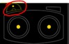   |     Jogwheel for manual fluid   application                                                                                                                         |
|         |     Shoulder button to apply fluid   amount determined by C/D buttons.     Hold for 5 seconds to reset the syringe position. Press again to cancel the reset.       |

**Pairing and calibration**
[Cube pilot documentation](https://docs.cubepilot.org/user-guides/herelink/herelink-user-guides/one-time-setup)

The controller might have to be calibrated before use. If there are irregularities with the joystick or buttons follow the step-by-step guide on the cubepilot website to calibrate the inputs. 

**Camera**
If the camera feed doesn’t start after approximately 5 seconds, restart the camera by pressing button 1 (on the camera).

**Setting up the Herelink Controller**
When the HerelinkController is used for the first time it needs to be configured and calibrated properly so the PCB can be properly paired with the air unit. 

More detailed information can be found at: 
https://docs.cubepilot.org/user-guides/herelink/herelink-user-guides/one-time-setup 

**Herelink Controller**
After connecting with Wifi update the Herelink Controller with the latest firmware. 

Next enter the radio settings menu with the top-down menu and check if the controllers’ air unit has the latest firmware. If not, you will have to download the air firmware and then transfer it to the air unit. 

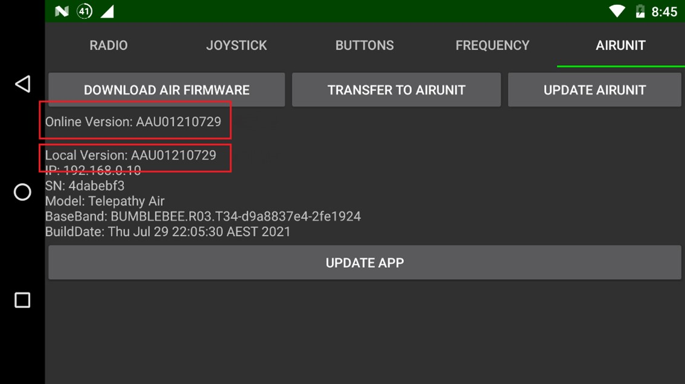

**Setting up the SBUS channels**

The joysticks and buttons have to be mapped to a specific SBUS channel (see further on) . In the Herelink settings menu add the following buttons and set their respective channels.
The default/active value has to be set to 1000 and 2000 respectively. All buttons should be set to Bus 1.

| Button           | Channel |
|------------------|---------|
| A short press    | 6       |
| B short press    | 7       |
| C short press    | 8       |
| D short press    | 9       |
| Cam short press  | 12      |
| Home short press | 10      |

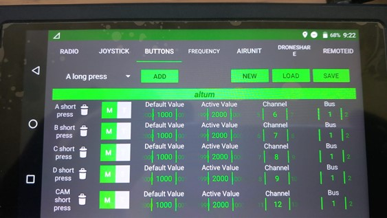

After configuring the buttons, press save, ignore the warning and the joysticks/buttons should be mapped correctly. 

**Configuring the GQGround Control app**

Currently the QGroundControl app is used to pass information via the Mavlink Protocol. 

In the QGround control app there is a widget showing Mavlink messages that can be customized. The following parameters are used by the Altum to show info about the device. They need to be activated by pressing the gear icon. 

**UPDATE WITH LATEST VALUES**

## Uploading the Firmware

Currently the firmware still has to be flashed to the chip using the SWIO wires. 

I’ve looked into uploading it via USB-C but this was a lot more complex than I thought and I couldn’t fit it in the scope of my bachelor thesis. Maybe this is something that can be implemented in the future although I think it won’t be easy. 

**Steps to upload the firmware**

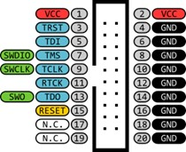

1. Connect the STLink V2 to your usb port and connect the jumpwires to the corresponding pins. 

3V3 -> VCC
SWDIO -> SWDIO
SWCLK -> SWCLK
GND -> GND

2. In STMCubeIDE go to run > **Run configurations**
3. In the Debugger tab under interface select "SWD" and check the "ST_link S/N (always scan)".
4. Run the project with the green arrow button 


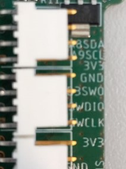

After the code has been uploaded you might need to perform a  manual reset on the PCB by either pressing the reset button, or by cutting the power and restarting. 

Keep in mind that the code will flash a debug version of the build with debug symbols etc, so this will increase the file size. If file size becomes critical in the future there are options to just upload a .bin file or .hex file to the STM32-chip

*If something goes wrong you can always do a full erase on the chip with the STMCubeProgrammer software. You might have to pull the reset pin high when connecting via the STLink and then remove it before the chip reaches timeout.*

**Assembly**

First and foremost the actuators will have to be connected to the PCB. The longest one should be connected to the fluid connector, push actuator to the push connector and selector actuator to the selector actuator. The metal of the female connectors should be visible.
The LED and DC motor also need to be connected to their corresponding connectors, watch out for the polarity of the cables. 
Next up is the Air unit. The necessary cables are provided with the Herelink Controller. The power cables need to be connected to the 12V output. Next are the UART connections responsible for the SBUS and Mavlink communication. 
The SBUS protocol just needs to be connected with two wires. We only use one SBUS channel, so the other cables can be removed. 
The other UART cable can be directly connected to the UART port on the PCB. 

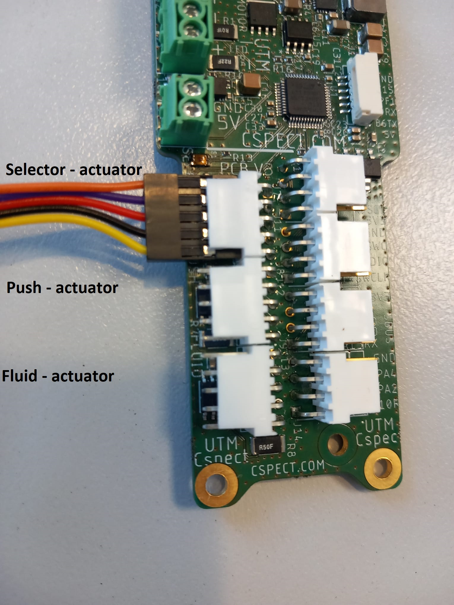

## Documentation for future development 

### Setting up the pins 

For the most part the drivers and components are configured in the HAL_library by using the user interface by opening the .ioc file. 

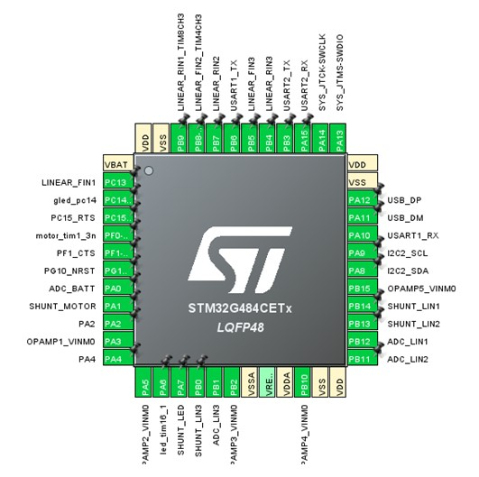

### Clock configuration 

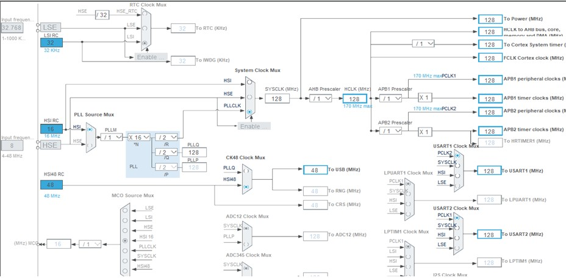

In the Clock configuration section in Change the  System Clock Mux  to PLLCLK and the CK48 Clock MUS to HSI48. The USB frequency should be 48MHz. 

### Components configuration

The following configurations need to be respected when starting a new project based on the Altum PCB: 

|     Categories      |     Subcategory            |     Config                                                                                                                  |
|---------------------|----------------------------|-----------------------------------------------------------------------------------------------------------------------------|
|     System Core     |     DMA                    |     USART1_RX: DMA1 Channel 1                                                                                               |
|                     |                            |     USART2_RX: DMA2 Channel 1                                                                                               |
|                     |                            |     ADC1 : DMA1 Channel 2                                                                                                   |
|                     |                            |     ADC2: DMA1 Channel 3                                                                                                    |
|                     |                            |     ADC5: DMA1 Channel 4                                                                                                    |
|                     |     SYS                    |     Debug: Trace Asynchronous SW                                                                                            |
|     Analog          |     ADC1                   |     IN1 Single Ended                                                                                                        |
|                     |                            |     IN11: Single Ended                                                                                                      |
|                     |                            |     IN12: Single Ended > check                                                                                              |
|                     |                            |     IN14 : Single Ended     VOPAMP1 Channel > check                                                                         |
|                     |     ADC2                   |     VOPAMP2 Channel > check                                                                                                 |
|                     |                            |     VOPAMP3 Channel > check                                                                                                 |
|                     |     ADC5                   |     VOPAMP5 Channel > check                                                                                                 |
|                     |     COMP2                  |     Input DAC1 OUT2                                                                                                         |
|                     |     COMP4                  |     DAC3 OUT2                                                                                                               |
|                     |     COMP5                  |     DAC4 OUT1                                                                                                               |
|                     |     COMP7                  |     DAC2 OUT1                                                                                                               |
|                     |     DAC1                   |     OUT1 Connected to on chip-periph   only                                                                                 |
|                     |                            |     OUT2 Connected to on chip-periph   only                                                                                 |
|                     |     DAC2                   |     OUT1 Connected to on chip-periph   only                                                                                 |
|                     |     DAC3                   |     OUT2 Connected to on chip-periph   only                                                                                 |
|                     |     DAC4                   |     OUT1 Connected to on chip-periph   only                                                                                 |
|                     |     OPAMP1                 |     PGA Internally Connected_IO                                                                                             |
|                     |     OPAMP2                 |     PGA Internally Connected_IO                                                                                             |
|                     |     OPAMP3                 |     PGA Internally Connected_IO                                                                                             |
|                     |     OPAMP4                 |     PGA Internally Connected_IO                                                                                             |
|                     |     OPAMP5                 |     PGA Internally Connected_IO                                                                                             |
|     Timers          |     TIM1 (cleanermotor)    |     Clock Source: Internal Clock                                                                                            |
|                     |                            |     Channel 3: PWM Generation CH3N                                                                                          |
|                     |                            |     Parameter settings: Counter   Period:1080     Parameter settings: Prescaler: 8                                          |
|                     |     TIM2                   |     Clock Source: Internal Clock                                                                                            |
|                     |     TIM3(fluidmotor)       |     Clock Source: Internal Clock                                                                                            |
|                     |                            |     Channel 1: PWM Generation CH1                                                                                           |
|                     |                            |     Channel 2: PWM Generation CH2                                                                                           |
|                     |                            |     Parameter settings: Prescaler : 2     Parameter Settings: Counter   Period: 1000                                        |
|                     |     TIM4(pushmotor)        |     Clock Source: Internal clock                                                                                            |
|                     |                            |     Channel 2: PWM Generation CH2                                                                                           |
|                     |                            |     Channel 3: PWM Generation CH3                                                                                           |
|                     |                            |     Parameter settings: Prescaler: 2                                                                                        |
|                     |                            |     Parameter settings: counter   period: 1000                                                                              |
|                     |     TIM8(selectormotor)    |     Clock Source: Internal clock                                                                                            |
|                     |                            |     Channel 3: PWM Generation CH3                                                                                           |
|                     |                            |     Channel 4: PWM Generation CH4N                                                                                          |
|                     |                            |     Parameter settings: Prescaler: 2     Parameter settings: prescaler: 2     Parameter settings: counter   period: 1000    |
|                     |     TIM16                  |     PWM Generation CH1                                                                                                      |
|     Connectivity    |     I2C                    |     All configurations default                                                                                              |
|                     |     USART1                 |     Asynchronous mode                                                                                                       |
|                     |                            |     USART1 global interrupt >   checked                                                                                     |
|                     |     USART2                 |     Asynchronous mode                                                                                                       |
|                     |                            |     USART2 global interrupt >   checked                                                                                     |
|                     |     USB                    |     All configurations default                                                                                              |
|     Middleware      |     USB_Device             |     Class for FS: Communication Device   Class (VCOM)                                                                       |


After all these pins are configured the STMCube IDE will automatically generate the necessary code.
Most of these components have a dedicated handletype in the HAL_library and these handletypes are used for configuring them and telling the HAL_library what PWM signal should be set for example. They are made automatically when STMCubeIDE generates code and will be placed in the main.c file.

Typically it will be structured as follows:

1. Includes
2. HandleType declarations
3. Function prototypes
4. Main function
5. Function implementations

Of course the developer still has to change these function to suit their own implementation. I’ve opted for an object-orientated approach, but STMCubeIDE supports both compilation for C++ and standard C. 

*To make the code OOP all these handlers have been saved in the “handlers.h” file. These are passed on to the initializer and components classes where they are configured.*

**!!!! The pin configurations work as they are, don’t start changing things here unless you know what you’re doing!!!!**

Basically the SBUS & MavLink protocol have been configured for use with DMA, while the Altimeter just uses the blocking functions of the HAL_Library. Because it’s I2C I haven’t really encountered any problems. This could (and probably should) be done with interrupts in the future to make the code more failsafe.

*The only real problem I encountered with DMA is the Multimode scanning. To summarize: it should be possible to scan up to 16 consecutive channels at the same time via DMA, but I could only get a maximum of 2 channels to work. Currently I use DMA to get the shunt values (current-in) from the ADC2 and ADC5 channels, but for ADC1 I use the normal HAL_ADC_Start() and HAL_ADC_Stop() functions from the HAL_Library.* 

### The USB_Device library and the "printf()" function

The printf() function does not work “out of the box”. To make it work we have to redirect the output of the _write function to the USB device. 

Here are the steps to make it work:

1. In the "src" directory, open the syscalls file
2. Include the following the header files:
    `#include <unistd.h>`
    `#include usb_divice.h`
3. Overwrite the _write function implementation with the following code:

```
_attribute__((weak)) int _write(int file, char *ptr, int len)
{
	if (file == STDOUT_FILENO || file == STDERR_FILENO)
		    {
		        uint8_t result;
		        do {
		        	result = CDC_Transmit_FS((uint8_t*)ptr, len);
		        } while (result == USBD_BUSY);
		        if (result != USBD_OK)
		        {
		            errno = EIO;
		            return -1;
		        }
		        return len;
		    }
		    errno = EBADF;
		    return -1;
}
```

### Debugger class

As the name implies this class is used for debugging. It takes a  pointer to a HerelinkController object as parameter and just prints out all sorts of useful data. 
To be honest, **this class can and will cause problems because of race conditions and other stuff**, so the connection to the Herelink Controller  might fail at times (a simple reset fixes this). As a general rule, it’s recommended to comment out the printf() functions that you don’t need, and keep the function in the main file commented out as well if you’re not debugging. 
Other Quirks and bugs I couldn’t fix:
!!! In the initializer class the MX_DMA_INIT() must be initialized before the initUSART1() function.
ADC multimode scanning over DMA is not working as it should, I could only scan 2 channels for some reason. I only use it for reading the shunt current of some of the ADC’s. ADC1 is read with a normal function.  

**Other quirks**

!!! In the initializer class the MX_DMA_INIT() must be initialized before the initUSART1() function.
ADC multimode scanning over DMA is not working as it should, I could only scan 2 channels for some reason. I only use it for reading the shunt current of some of the ADC’s. ADC1 is read with a normal polling function.  

## Codebase

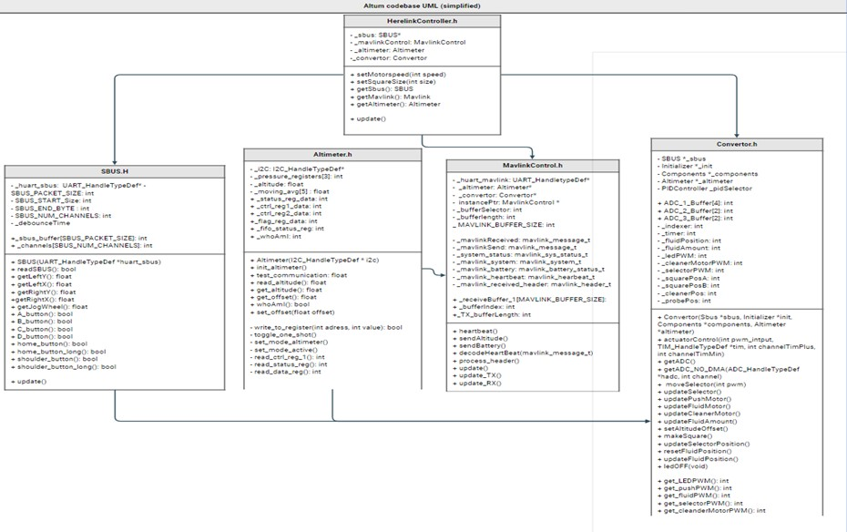

### General info

**The Altum PCB and the Herelink Controller communicate via 2 different protocols: SBUS and MavLink.**

As previously mentioned, a Herelink controller is used to control various actuators, etc. The buttons and joysticks of this controller transmit their signals via the SBUS protocol. **The SBUS protocol** is a serial communication protocol commonly used in model building to control RC devices such as drones. It was developed by Futaba, one of the largest manufacturers of RC equipment, and is now a standard protocol used by various manufacturers.
It is a bi-directional single-wire protocol that transmits data at a rate of 100,000 bits per second (baud rate). **Specifically, packets of a fixed size of 25 bytes are transmitted. The 16 different channels are extracted from these frames, and they must be manually parsed.**

**MAVLink** was designed to enable efficient and reliable communication between unmanned vehicles and a ground station or other systems. It is platform-independent and supports both serial and network communication. The protocol is based on a master-slave architecture, with the unmanned vehicle as the slave and the ground station as the master. Unlike the SBUS protocol, MAVLink has a variable size between 12 and 280 bytes. MAVLink uses "messages" such as status messages, command messages, and other data messages. These are structured into packets and sent with a CRC checksum to detect errors in communication.

**To summarize: the SBUS protocol handles the joystick and button input, the MavlLink protocol is used to send info to and from the QGroundControl app.**

### Main.cpp file


I’ve tried to keep the main.cpp file as simple as possible. 
*Currently I keep the huart handlers as global vars, I’ll try to move them to the handlers.h file as well if possible.*
First the necessary handlers are configured in the Initializer and Components classes. Next there’s the initialization of the HerelinkController object. This is an overarching object that contains the SBUS, Mavlink, Altimeter & Convertor implementations in its’ subclasses.  
In the while(1) loop I just call the `HerelinkController.update()` continuously. The sequence/order of the methods that are called here is important. 

### HerelinkController class

The class has two constructors: a default constructor and a parameterized constructor that takes in pointers to instances of "UART_HandleTypeDef", "Initializer", and "Components".

The class has three member functions: `setMotorSpeed()`, `setSquareSize()`, and `update()`. The `setMotorSpeed()` function takes an integer argument and sets the motor speed accordingly. The `setSquareSize()` function takes an integer argument and sets the square cleaner size accordingly. The `update()` function is responsible for calling the member functions of the subclasses in a specific order.

The class also includes several getter functions such as `getSbus()`, `getMavlink()`, and `getAltimeter()`. 

This is a class that is meant to be accessible. The basic behaviour of the Altum can be changed here. 
In this class 4 objects of the following “subclasses” (they’re pretty intertwined though) are created:

- `Altimeter _altimeter`
- `MavlinkControl _mavlink`
- `Convertor _convertor`
- `SBUS _sbus`

### SBUS class

**Overview**

The SBUS class is designed to read data from an SBUS receiver and parse it to extract the relevant information for the Herelink controller. The SBUS protocol is a serial communication protocol used to control model aircraft and other unmanned vehicles. In this implementation, the SBUS data is received through UART and parsed to extract the channel data.

**Public Member functions:**

`SBUS(UART_HandleTypeDef *huart_sbus);`
The constructor of the SBUS class. It takes a pointer to a `UART_HandleTypeDef` object representing the UART interface that is used to receive SBUS data. 

`void update(void);`
This function is called to update the SBUS data. It first checks if there is new data available and if so, it calls the `readSBUS()` function to parse the data.

`bool readSBUS(void);`
This function is responsible for parsing the raw SBUS data and extracting the channel data. It stores the channel data in the `_channels` array.

`uint16_t* getChannels(void);`
This function returns a pointer to the `_channels` array. The array contains the channel data.

**Private Member Variables**

`UART_HandleTypeDef *_huart_sbus;`
A pointer to a `UART_HandleTypeDef` object representing the UART interface used to receive SBUS data.

`uint8_t _sbus_buffer[SBUS_PACKET_SIZE];`
An array of `uint8_t` elements to store the raw SBUS data. The size of the buffer is defined by the `SBUS_PACKET_SIZE` constant.

`uint16_t _channels[SBUS_CHANNELS];`
An array of `uint16_t` elements to store the extracted channel data. The size of the array is defined by the `SBUS_CHANNELS` constant. The extracted data is stored in this array in the following order:

|     SBUS Channel    |                         |
|---------------------|-------------------------|
|     0               |     Right Joystick X    |
|     1               |     Right Joystick Y    |
|     2               |     Left joystick X     |
|     3               |     Left joystick Y     |
|     4               |     Jogwheel            |
|     5               |     Button A            |
|     6               |     Button B            |
|     7               |     Button C            |
|     8               |     Button D            |
|     9               |     Button “Home”       |
|     10              |     Shoulder button     |

**Constants**

`SBUS_PACKET_SIZE`
A constant representing the size of the SBUS packet. The SBUS protocol uses a 25-byte packet.

`SBUS_CHANNELS`
A constant representing the number of channels in the SBUS data. The Herelink controller has 16 channels, but only 13 channels are used in this implementation. The first four channels are used for the joysticks and the jogwheel, and the remaining channels are used for the buttons and triggers.

### MavlinkControl.h class

The MavlinkControl class in the given C++ code is used to implement communication with a MAVLink enabled drone using an UART interface. Thankfully, there’s an extensive library available to make life a bit easier. This library contains a lot of helpful functions to interface between the Herelink Controller and the STM32 chip. https://mavlink.io/en/

Like already mentioned before, Mavlink is a protocol that works with “messages”. These are structs that are known by the QGroundControl app and can be linked to for example different values on the HUD display. 
To make the connection with the HerelinkController, a ‘heartbeat’ message must be sent periodically (something in the order of 500ms).  Note that the HearBeat() method cannot be called continuously or it will block the SBUS protocol.

Here’s a brief overview of how you can send and receive messages with MavLink: 

**Sending messages**

A message is a struct which the MavLink protocol uses to encapsulate its data. This message is then sent over UART to the Air Unit which forwards it to the Herelink controller. 

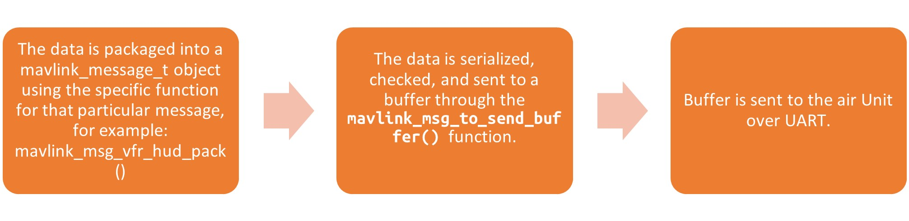

```
void MavlinkControl::sendTestMessage(void){

	float testValue = 122.0f;

	_mavlink_battery.battery_remaining = 50;

	// mavlink_msg_vfr_hud_pack function below repacks the value to a hud message. These can be configured on the QgroundControl app.
	//The hud message can contain values such as ground speed, altitude, etc... autocomplete will give you an overview
	//of the different values that can be sent. The values itself are hardcoded into the firmware of the Herelink controller though

mavlink_msg_vfr_hud_pack(_mavlink_system.sysid, _mavlink_system.compid,&_mavlinkSend, testValue, 0.0f,0,0,0,0);
	_TX_bufferLength = mavlink_msg_to_send_buffer(_bufferPackedforUart, &_mavlinkSend);
	if( HAL_UART_Transmit(_huart_mavlink, _bufferPackedforUart, _TX_bufferLength, 100) == HAL_ERROR){
		this->Error_Handler();
	}


}
```

The heartbeat message is encoded in a similar fashion. Note that the bufferlength can be returned from both the = `mavlink_msg_heartbeat_encode()` function or the `mavlink_msg_to_send_buffer()` function.

```
void MavlinkControl::heartbeat(void){


	_bufferLength = mavlink_msg_heartbeat_encode(
			_mavlink_system.sysid, _mavlink_system.compid, &_mavlinkSend,
			&_mavlink_heartbeat);

	mavlink_msg_heartbeat_pack(_mavlink_system.sysid, _mavlink_system.compid,
			&_mavlinkSend, MAV_TYPE_GROUND_ROVER, MAV_AUTOPILOT_GENERIC,
			MAV_MODE_FLAG_SAFETY_ARMED, 0, MAV_STATE_STANDBY);
	mavlink_msg_to_send_buffer(_bufferPackedforUart, &_mavlinkSend);

	if(HAL_UART_Transmit_IT(_huart_mavlink,_bufferPackedforUart, _bufferLength) == HAL_ERROR){
				this->Error_Handler();
	}

}
```

**Receiving messages**

Receiving messages is a bit trickier than reading the SBUS protocol because the messages have a variable length up to 280 bytes. 
Each byte has a specific “magic” start byte, so it’s possible to just manually read the UART bus and then copy it to a buffer. However in reality this proved to cause race conditions. 
I ultimately used an internal callback function from the HAL library that fills a buffer byte by byte to be passed to the `mavlink_parse_char()` function. This parses the incoming bytes into a `_mavlink_message_t struct`. These structs can then be further decoded. 

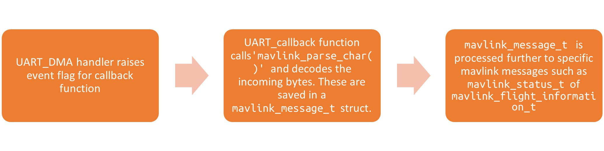

```
void HAL_UARTEx_RxEventCallback(UART_HandleTypeDef *huart, uint16_t Size) {

  // Access the instance of the class using the static member variable
  MavlinkControl* instance = MavlinkControl::instancePtr;

//  instance->process_header();
  mavlink_status_t status;
  mavlink_message_t msg;

  while (mavlink_parse_char(MAVLINK_COMM_0, instance->_receiveBuffer_1[instance->_bufferIndex++], &instance->_mavlinkReceived, &instance->_status) == MAVLINK_FRAMING_INCOMPLETE);
  instance->_mavlink_received_header.magic = instance->_mavlinkReceived.magic;
  instance->_mavlink_received_header.sysid = instance->_mavlinkReceived.sysid;
  instance->_mavlink_received_header.compid = instance->_mavlinkReceived.compid;
  instance->_mavlink_received_header.seq = instance->_mavlinkReceived.seq;
  instance->_mavlink_received_header.compat_flags = instance->_mavlinkReceived.compat_flags;
  instance->_mavlink_received_header.incompat_flags = instance->_mavlinkReceived.incompat_flags;
  instance->_mavlink_received_header.msgid = instance->_mavlinkReceived.msgid;
  instance->_mavlink_received_header.len = instance->_mavlinkReceived.len;

  instance->readFlightTime(instance->_mavlinkReceived);
  instance->decodeHeartbeat(instance->_mavlinkReceived);


  instance->_bufferIndex = 0;

}

```

**Current implementation**

Currently the MavLink protocol is used to:

1. Send the altitude from the altimeter to the HUD *(Implementation removed in latest version, altimeter is not accurate enough)*.
2. Sending the remaining battery voltage to the HUD
3. Send the amount of fluid to apply 
4. Fluid actuator position

**Public member functions**

`MavlinkControl();`
Default constructor. 

`MavlinkControl(UART_HandleTypeDef* huart, Altimeter* altimeter, Convertor* convertor);`
Constructor that takes pointers to UART handler, Altimeter object and Convertor object as arguments.

`void update_RX()`
A function used to update the receive buffer with data from the UART interface.

`void heartbeat()`
Function used to send a MavLink heartbeat message over the UART interface.

`void sendTestMessage()`
Function to send a test message over the UART interface.

`void decodeHeartbeat(mavlink_message_t receivedMessage)`
Function used to decode MavLink heartbeat message

`mavlink_header_t getMavlinkHeader()`
Function used to get the header information of the received MavLink message (mainly for debugging purposes).

**Private member variables**

`_huart_mavlink`: A pointer to the UART handler for MAVLink communication.
`_altimeter`: A pointer to an Altimeter object used for altitude measurement.
`_convertor`: A pointer to a Convertor object used for unit conversion.
`_mavlink_system`: A struct that contains the MAVLink system ID, component ID and type.
`_mavlink_heartbeat`: A struct that contains the MAVLink heartbeat message fields.
`_mavlinkReceived`: A struct that contains the received MAVLink message.
`_status`: A MAVLink status struct that contains the parsing status of the received message.
`_bufferIndex`: An index used to keep track of the buffer position while parsing received messages.
`_mavlink_received_header`: A struct that contains the header information of the received MAVLink message.
`_receiveBuffer_1`: An array used to store the received data.
`_receiveBuffer_2`: An array used to store the received data.
`_bufferPackedforUart`: An array used to store the packed MAVLink message for UART 
`_mavlinkSend`: A MAVLink message struct used for sending messages.
`_bufferLength`: The length of the packed MAVLink message.
`_TX_bufferLength`: The length of the packed MAVLink message for transmission.

### Altimeter.h class 

This class represents the MPL3115A2 altimeter/pressure meter chip. The class contains several private fields that store register addresses and data for the MPL3115A2 chip, as well as a pointer to an I2C_HandleTypeDef object, which is used to communicate with the chip over the I2C protocol.
The sensor has different registers that contain the configuration of the chip. See the datasheet for more detailed information. In the Altum implementation, the sensor is initialized as an altimeter, the oversampling is set to x128, and the values are read continuously while using the “one shot mode”. 
This sensor has a LOT of noise, causing the altitude meter’s accuracy to fluctuate too much. Even with oversampling at the maximum (which should improve accuracy), there was still too much difference between two consecutive measurements.
In the end, I was able to "smooth out" the error by taking a moving average of the last five measurements. If a more accurate altitude is needed, consideration will need to be given to purchasing a more expensive sensor or possibly even switching to an (also more expensive) RTK system that determines the position based on GPS satellites. 

**Currently the altimeter is not implemented because of the low accuracy. However I'm keeping this here for future reference**

**Public methods**

`Altimeter()`
Default constructor for the Altimeter class. This initializes the _i2c member variable to NULL.

`Altimeter(I2C_HandleTypeDef* i2c)`
Constructor that takes an I2C_HandleTypeDef pointer as an argument. This initializes the _i2c member variable to the given value.

`void init_altimeter()`
Method to initialize the altimeter. This method sets the oversampling mode, event flags, and puts the altimeter in standby mode.

`float test_communication()` 
Method to test the communication with the altimeter by reading the value of the who_am_I register. This method returns the value of the who_am_I register.

`float read_altitude()`
Method to read the altitude data from the altimeter. This method returns the altitude in meters.

`float debug_altitude()`
Method to print the raw altitude data and various registers of the altimeter for debugging purposes. This method returns the altitude in meters.

`float get_altitude()`
Method to get the current altitude value.

`float get_offset()`
Method to get the altitude offset value.

`bool whoAmI()`
Method to read the who_am_I register of the altimeter and check if the communication with the altimeter is working properly. This method returns true if the communication is working and false otherwise.

`void set_offset(float offset)`
Method to set the altitude offset value.

`float process_altitude(float altitude)`
Method to process the altitude data by subtracting the altitude offset and taking a moving average of the data. This method returns the processed altitude in meters.

**Private members**

`i2c`: Pointer to the I2C_HandleTypeDef struct that is used for communication with the altimeter.
`_altimeter_address, _altimeter_read_address, _altimeter_whoAmI, _altimeter_status_reg, _altimeter_ctrl_reg_1, _altimeter_ctrl_reg_2, _altimeter_fifo_status_reg, _altimeter_pressure_MSB, _altimeter_pressure_CSB, _altimeter_pressure_LSB, _altimeter_delta_pressure_MSB, _altimeter_delta_pressure_CSB, _altimeter_delta_pressure_LSB, _altimeter_temperature_MSB, _altimeter_temperature_LSB, _altimeter_data_event_flag_reg`: Constants that define the memory addresses of various registers of the MPL3115A2 altimeter sensor.
`_pressure_registers`: Array that stores the raw pressure data read from the altimeter.
`_altitude`: Variable that stores the altitude value.
`_altitude_offset`: Variable that stores the altitude offset value.
`_delta_altitude`: Variable that stores the change in altitude over time.
`_moving_avg`: Variable that stores the moving average of the altitude data.
`_tempArray`: Array that stores the altitude data for computing the moving average.

### Convertor.h class 

**This class is used for converting the results of the SBUS and Altitude functions to useful PWM signals and/or values that can be used to drive the actuators or process their feedback signals.**

This class started out small but as it was usually the most logical place to handle the signal conversions, so it quickly grew. The convertor class  provides functions to convert the SBUS protocol to PWM values, control actuators, and update various motors and sensors. The class also provides getters for different sensor readings such as pot positions, shunt(current), and battery voltage. 

The Convertor.h class also includes a PIDController class. This is used to keep the linear motor of the selector-actuator in position.
*A PIDController is a control algorithm that uses feedback to continuously adjust an output based on the difference between a desired setpoint and the actual process variable. It consists of three components: proportional (P), integral (I), and derivative (D) terms, each of which contributes to the controller's output in different ways. The P term responds to the current error, the I term integrates the error over time to eliminate steady-state errors, and the D term predicts future error trends to stabilize the system's response.*

There’s a pretty good pdf in the PIDController directory explaining this in greater detail. 

**Public methods**

`Convertor()`
Default constructor

`Convertor(SBUS *sbus, Initializer *init, Components *components, Altimeter* altimeter)`
Constructor that takes pointers to SBUS, Initializer, Components, and Altimeter objects.

`void actuatorControl(int16_t pwm_input, TIM_HandleTypeDef *tim, uint32_t channelTimPlus, uint32_t channelTimMin)` General function for controlling actuator movement/PWM. Runs at standard 64khz.

`void getADC(void)`
Gets the ADC value and fills up the corresponding buffers. 


`uint16_t getADC_NO_DMA(ADC_HandleTypeDef *hadc, uint32_t Channel)`
Used for reading ADC1 without DMA (normal polling).

`void moveSelector(int16_t pwm)`
Used for controlling the selector position

`void updateSelector(void)`
Updates the selector. The selector has three positions, which correspond to different values of a private member variable called `_indexer`. If the right joystick is moved to the left, the `_indexer` is set to 0. If it is moved to the right, the `_indexer` is set to 1. If it is moved down, the `_indexer` is set to 2. The function also debounces the input to prevent multiple positions from being registered for a single movement. 

`void updateLED(void)`
Uses incremental PWM to update the led brightness

`void updatePushMotor(void)` : Updates the push motor.
`void updateFluidMotor(void)` : Updates the fluid motor.
`void updateCleanerMotor(void)` : Updates the cleaner motor.
`void updateFluidAmount(void)` : Updates the fluid amount.
`void setAltitudeOffset(void)` : Sets the altitude offset.

**Public variables**

*These will probably be moved to private after everything is tested. I kept these public for debugging purposes*

`bool _debounceTrigger`: used for determining if the joystick position has returned to center
`uint8_t _indexer` : used for determining the selector mode: cleaner positon/probe position/make square

**Private variables**

`SBUS *_sbus`: pointer to SBUS object created in HerelinkController class
`Initializer *_timers`: pointer to the initializer class for getting the timers necessary for PWM generation
`int16_t _ledPWM`: An integer variable that stores the current pulse-width modulation (PWM) value for the LED.
`int16_t _cleanerMotorPWM`: An integer variable that stores the current PWM value for the cleaner motor.
`int16_t _selectorPWM`: An integer variable that stores the current PWM value for the selector.
`int16_t _pushMotorPWM`: An integer variable that stores the current PWM value for the push motor.
`int16_t _fluidPWM`: An integer variable that stores the current PWM value for the fluid.
`int16_t _squarePosA`: A floating-point variable that stores the position value for square position A.
`int16_t _squarePosB`: A floating-point variable that stores the position value for square position B.
`int16_t _cleanerPos`: A floating-point variable that stores the position value for the cleaner.
`int16_t _probePos`: A floating-point variable that stores the position value for the probe.

`PIDController _pidSelector`; : PIDController object. Used as follows in the Convertor.cpp file

```
void Convertor::updateSelectorPosition(void){


		_pidSelector.measurement = this->get_selector_position();
		PIDControllerUpdate(&_pidSelector);
		_selectorPWM =(int16_t) _pidSelector.out;
		this->moveSelector(_selectorPWM);


}

```

 The function first reads the current selector position from the sensor using the `get_selector_position()` function, and sets it as the measurement for the PID controller.

 Then, the function calls the `PIDControllerUpdate()` function with `_pidSelector` as the argument. This updates the internal state of the PID controller based on the current measurement and the desired setpoint.The output of the PID controller is then stored in the `_selectorPWM` variable, which represents the required pulse width modulation (PWM) value to move the selector to the desired position.

Finally, the function calls the `moveSelector()` function with the `_selectorPWM` value as the argument. This function updates the PWM signal to the selector motor to move it to the desired position based on the calculated PWM value.
